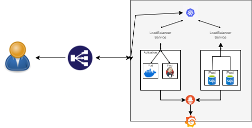

## Documentacion en Notion
    https://www.notion.so/team/17a2cda8-3bf1-81e2-a482-0042c096c551/join

## 1. Diseño de Infraestructura
    • Enunciado: Diseñar una arquitectura para implementar una aplicación web escalable. La solución debe incluir:
    • Uso de contenedores (Docker) y orquestación (Kubernetes).
    • Integración de una base de datos (PostgreSQL o MongoDB) con alta disponibilidad.
    • Un pipeline CI/CD para despliegues automáticos.
    • Monitoreo del sistema con Prometheus y Grafana.
## Entregables:
    • Un diagrama de arquitectura detallado utilizando herramientas como Lucidchart, Draw.io o similar.
    • Justificación técnica de cada componente incluido en la arquitectura.

## Solucion



## 2. Implementación de un Pipeline CI/CD
    • Enunciado: Crear un pipeline de CI/CD para una aplicación Node.js basado en el siguiente repositorio: GitHub - sport-enlace-sas/frontend-challenge-base
    • Clonar el repositorio desde GitHub.
    • Construir y testear la imagen Docker.
    • Publicar la imagen en un registry público/privado.
    • Desplegar la aplicación automáticamente en un clúster Kubernetes usando ArgoCD.
## Entregables:
    • Archivo de configuración para el pipeline (Jenkinsfile, GitHub Actions YAML, etc.).
    • Archivos de configuración para ArgoCD.
    • Documentación breve explicando cómo replicar el pipeline.

## 1. Creación del Dockerfile

1. Crea un archivo llamado Dockerfile en tu proyecto con el siguiente contenido:

    ```dockerfile
    # Etapa de construcción
    FROM node:18.17.0-alpine AS builder
    
    # Establecer directorio de trabajo
    WORKDIR /app
    
    # Copiar archivos de package
    COPY package*.json ./
    
    # Instalar dependencias
    RUN npm install
    
    # Copiar todos los archivos
    COPY . .
    
    # Construir la aplicación
    RUN npm run build
    
    # Etapa de producción
    FROM node:18.17.0-alpine AS runner
    
    # Establecer directorio de trabajo
    WORKDIR /app
    
    # Copiar archivos necesarios desde el builder
    COPY --from=builder /app/package*.json ./
    COPY --from=builder /app/.next ./.next
    COPY --from=builder /app/public ./public
    COPY --from=builder /app/node_modules ./node_modules
    
    # Exponer puerto 3000
    EXPOSE 3000
    
    # Iniciar la aplicación
    CMD ["npm", "start"]
    ```

## 2. Crear y Subir la Imagen a Docker Hub

1. Construye la imagen Docker:

    ```sh
    docker build -t <tu-usuario>/mi-aplicacion:latest .
    ```

2. Inicia sesión en Docker Hub:

    ```sh
    docker login
    ```

3. Sube la imagen a Docker Hub:

    ```sh
    docker push <tu-usuario>/mi-aplicacion:latest
    ```

## 3. Ejecutar la Imagen y Testear

1. Ejecuta la imagen Docker:

    ```sh
    docker run -d -p 3000:3000 <tu-usuario>/mi-aplicacion:latest
    ```

2. Accede a http://localhost:3000 en tu navegador para verificar que la aplicación esté funcionando correctamente.

## 4. Instalación de ArgoCD y Minikube

Para instalar Minikube y ArgoCD, sigue las siguientes guías oficiales:
- [Instalación de Minikube](https://minikube.sigs.k8s.io/docs/start/?arch=%2Fwindows%2Fx86-64%2Fstable%2F.exe+download)
- [Instalación de ArgoCD](https://argo-cd.readthedocs.io/en/stable/cli_installation/)

Una vez instalados, ejecuta los siguientes comandos para iniciar Minikube y desplegar ArgoCD:

1. Inicia Minikube:

    ```sh
    minikube start
    ```

2. Instala ArgoCD en el clúster de Minikube:

    ```sh
    kubectl create namespace argocd
    kubectl apply -n argocd -f https://raw.githubusercontent.com/argoproj/argo-cd/stable/manifests/install.yaml
    ```

3. Accede al dashboard de ArgoCD:

    ```sh
    kubectl port-forward svc/argocd-server -n argocd 8080:443
    ```

    Luego, abre tu navegador y ve a `https://localhost:8080`.

## 5. Creación de Archivos de Despliegue

Crea los siguientes archivos de despliegue:

### deployment.yaml

```yaml
apiVersion: apps/v1
kind: Deployment
metadata:
  name: frontend-challenge
  labels:
    app: frontend-challenge
spec:
  replicas: 2
  selector:
    matchLabels:
      app: frontend-challenge
  minReadySeconds: 20
  strategy:
    type: RollingUpdate
    rollingUpdate:
      maxSurge: 1
      maxUnavailable: 0
  template:
    metadata:
      labels:
        app: frontend-challenge
    spec:
      containers:
        - name: frontend
          image: jhoncastro1/next:v1.0
          ports:
            - containerPort: 3000
```
### service.yaml
  ```yaml
    apiVersion: v1
    kind: Service
    metadata:
      name: frontendchallenge1
    spec:
      selector:
        app: frontend-challenge
      ports:
        - protocol: TCP
          port: 80
          targetPort: 3000
      type: NodePort
  ```
  

## 3. Solución de Problemas
    • Enunciado: Basado en el siguiente docker compose docker-compose.yaml, corregir el archivo que está mal construído y optimizado.
## Entregables:
    • Archivo corregido docker-compose.yml .
    • Descripción breve de los errores encontrados y cómo se solucionaron.

```yaml
version: '3.8'
services:
  app:
    image: nginx:1.24  #específica la version
    ports:
      - "8080:80"
    volumes:
      - ./app/nginx.conf:/etc/nginx/nginx.conf:ro  # configuración correcta
    environment:
      NODE_ENV: "production"
    depends_on:
      - database
    networks:
      - app_network

  database:
    image: postgres:alpine
    volumes:
      - pg_data:/var/lib/postgresql/data  # Volumen para postgres
    environment:
      POSTGRES_USER: ${DB_USER}  # Variables de entorno
      POSTGRES_PASSWORD: ${DB_PASSWORD}
      POSTGRES_DB: ${DB_NAME}
    ports:
      - "5432:5432"
    networks:
      - app_network

  redis:
    image: redis
    command: redis-server --requirepass ${REDIS_PASSWORD}  # contraseña desde variable de entorno
    networks: 
      - app_network  # solo necesita estar en la red

volumes:
  pg_data:

networks:
  app_network:
    driver: bridge
    ```

